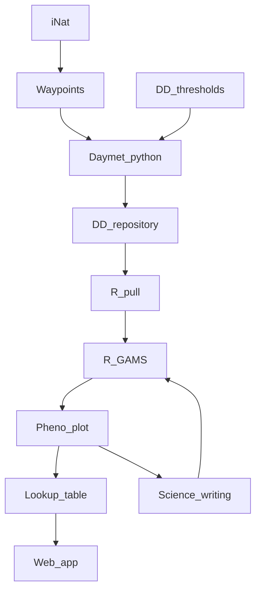

```mermaid
graph TD;
    iNat-->Waypoints;
    Waypoints--> Daymet_python;
    DD_thresholds --> Daymet_python;
    Daymet_python --> DD_repository;
    DD_repository --> R_pull;
    R_pull --> R_GAMS;
    R_GAMS --> Pheno_plot;
    Pheno_plot --> Lookup_table;
    Pheno_plot --> Science_writing;
    Science_writing --> R_GAMS;
    Lookup_table --> Web_app;
```